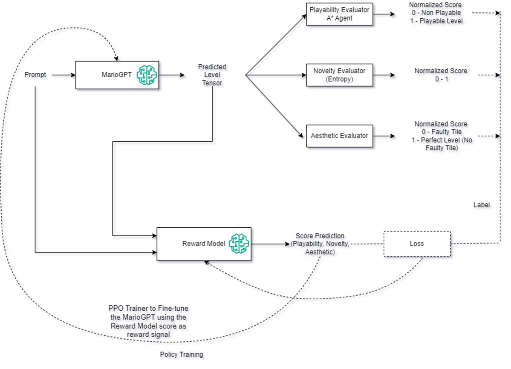

    

# Enhancing Game Level Generation via RLCF-guided MarioGPT

RLCF - Reinforcement Learning from Computer-based Evaluator Feedback

This research investigates reinforcement learning-based fine-tuning of MarioGPT to enhance alignment with specific game 
level design preferences. A computer-based evaluator function was employed to score levels across playability, novelty, 
and aesthetic aspects. The dataset, generated by sampling over 9,900 levels from the original MarioGPT model and 
scoring them using the evaluator function, was used to train a reward model. This reward model assesses level designs 
and provide reward (i.e. the 3 scores), which were then utilized to fine-tune the original MarioGPT model through 
Proximal Policy Optimization (PPO).

How does it work?
-----------------

This visual represents the training process used to fine-tune MarioGPT, aligning it with the evaluator function's 
preference to produce levels that are more playable, novel, and aesthetically appealing.

User guide
----------

- [sampling_mariogpt.py](mario_gpt%2Fsampling_mariogpt.py) Performs sampling on the MarioGPT model, facilitating the 
generation of level designs.

- [playability_measure.py](mario_gpt%2Fplayability_measure.py) Evaluates and scores the playability of the Mario level 
designs, aiding in quality assessment.
- [shannon_entropy.py](mario_gpt%2Fshannon_entropy.py) Evaluates and scores the novelty of the Mario level 
designs, aiding in quality assessment.
- [aesthetic_evaluator.py](mario_gpt%2Faesthetic_evaluator.py) Evaluates and scores the aesthetic of the Mario level 
designs, aiding in quality assessment.

- [preference_model.py](mario_gpt%2Fpreference_model.py) The Reward/Preference model, which can be trained using 
the dataset generated by sampling along with evaluator function scores for the sampled levels.

- [value_head.py](mario_gpt%2Fvalue_head.py) Implementation of Value Head, which is used as value function during
the PPO training of MarioGPT.

- [ppo_trainer.py](mario_gpt%2Fppo_trainer.py) Implementation of the Proximal Policy Optimization (PPO) trainer to 
fine-tune the MarioGPT model by leveraging the preference model for optimized level design generation.

Currently, each step in the process must be executed sequentially. In the future, the goal is to streamline this 
workflow into a single, unified pipeline for the ease of use.

Requirements
------------
- Python 3.12

Citation
--------
@misc{https://github.com/tsmbalu/MarioGPT_RL,

  author = {Balasubramani Murugan},  

  keywords = {Artificial Intelligence (cs.AI), Computation and Language (cs.CL), FOS: Computer and information sciences, FOS: Computer and information sciences},
  
  title = {Enhancing Game Level Generation via RLCF-guided MarioGPT},

  year = {2024},
}

Reference
----------
@misc{https://doi.org/10.48550/arxiv.2302.05981,
  doi = {10.48550/ARXIV.2302.05981},
  
  url = {https://arxiv.org/abs/2302.05981},
  
  author = {Sudhakaran, Shyam and González-Duque, Miguel and Glanois, Claire and Freiberger, Matthias and Najarro, Elias and Risi, Sebastian},
  
  keywords = {Artificial Intelligence (cs.AI), Computation and Language (cs.CL), FOS: Computer and information sciences, FOS: Computer and information sciences},
  
  title = {MarioGPT: Open-Ended Text2Level Generation through Large Language Models},
  
  publisher = {arXiv},
  
  year = {2023},
  
  copyright = {arXiv.org perpetual, non-exclusive license}
}

Github: https://github.com/shyamsn97/mario-gpt 